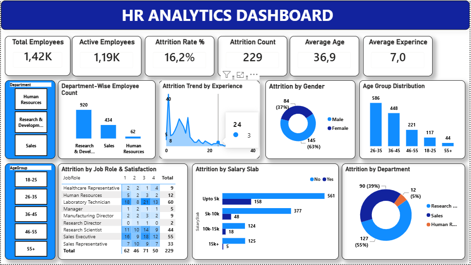

# 👥 HR-ANAYLYTICS-DASHBOARD
 
## 📌 Project Overview

The purpose is to analyze the factors that leads employees to
leave the organization and identify patterns that HR can act on.

## Data Source 
**Source:** Kaggle  
**Dataset:** HR Analytics Employee Attrition
**Link:** [Download here](https://www.kaggle.com/datasets/pavansubhasht/ibm-hr-analytics-attrition-dataset)

## 🎯 Business Questions

- What is the overall employee attrition rate?
- Which departments have the highest attrition?
- Which age groups have the highest attrition?
- Which job roles experience the most attrition?
- Does salary influence employee attrition?
- Does employee tenure affect attrition?

## 🛠️ Tools Used
### | Tool | Purpose |
- | *SQL* | transformation & analysis |
- | Power Query | Data cleaning, exploratory analysis |
- | Power BI | Data visualization & dashboard development |

## 📊 Dashboard

  The Power BI dashboard contains:

### 📌 KPI Cards

- Total Employees
- Active Employees
- Attrition Count
- Attrition Rate
- Average Age
- Average Experience

### 📊 Visualizations

- Attrition by Department
- Attrition by Gender 
- Attrition by Salary slab
- Attrition trend by experience
- Attrition by job role & satisfaction
- Department-wise count
- Age group distribution 

## 🔍 Key Insights

- Department with the highest attrition
- Job role with the highest attrition
- Age group with the highest attrition
- Relationship between salary and attrition

## 💡 Recommendations

- Improve retention strategies for high-attrition departments.
- Review compensation for affected employee groups.
- Develop career-development opportunities.
- Investigate employee satisfaction and workload factors.
